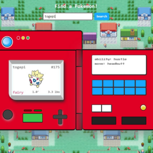

<h3>Connect with me:</h3>

<h3>Languages and Tools:</h3>

          

 
<!-- 

 -->

<!-- ## Projects -->

<!-- PROJECTS BEGIN -->
<!--
<table bordercolor="#33bef5">
  <tr>
    <td width="50%" valign="top">
      <h3 align="center">Pokedex</h3>
       
      <a href="https://brookebytes.github.io/Pokedex/" target="_blank">
        

      </a>
       
      

        <strong>HTML, CSS, JavaScript</strong> - Allowing users to search and view pokemon and their stats
      

    </td>
  </tr>
</table>
-->

